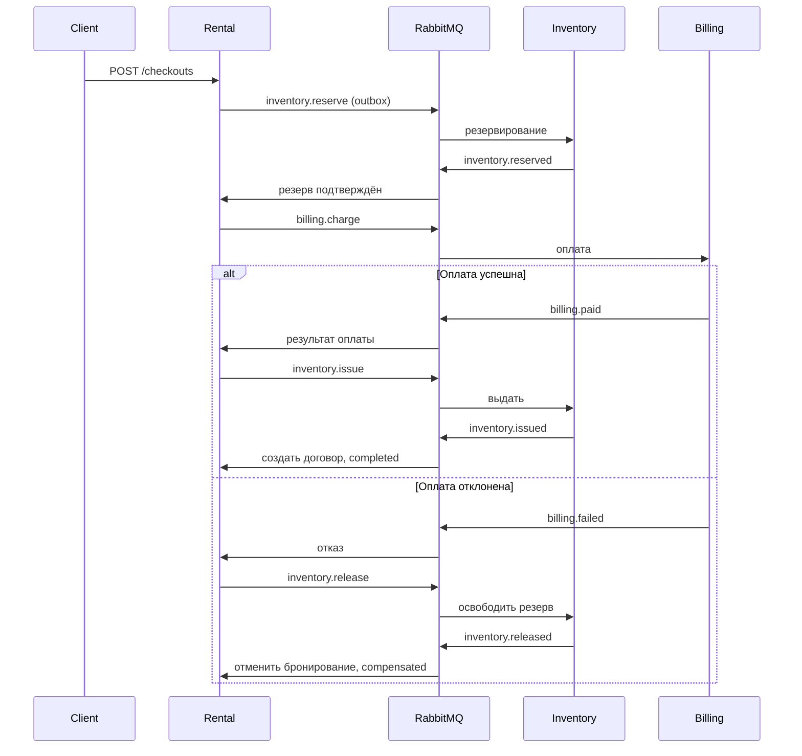

# Sport Rental — DDD, микросервисы и распределённые взаимодействия

Учебная система проката спортивного инвентаря: **6 предметных контекстов, 13 бизнес-агрегатов**
и отдельный **сервис авторизации**. Python 3.13+, FastAPI, PostgreSQL, Redis, RabbitMQ, gRPC.

## Выполненные требования

| № | Требование | Реализация |
|---|---|---|
| 1 | Контейнеры и Compose | Dockerfile каждого сервиса; `compose.yaml`; healthcheck и зависимости запуска |
| 2 | Redis | Cache-aside чтения агрегатов, TTL 60 секунд, версия кеша меняется атомарно с данными |
| 3 | PostgreSQL | Отдельные БД и роли сервисов, SQLAlchemy + psycopg, локальные транзакции |
| 4 | Распределённая транзакция | Оркестрируемая saga в rental: резерв → оплата → выдача; при отказе — освобождение резерва |
| 5 | Transactional outbox/inbox | Данные и outbox пишутся вместе; inbox и результат обработки фиксируются вместе |
| 6 | Шина сообщений | RabbitMQ, durable queues, persistent messages, publisher confirms, manual ack, DLQ |
| 7 | gRPC | rental синхронно вызывает customers.CheckEligibility перед бронированием |
| 8 | JWT | auth: регистрация, вход, Argon2, RS256 JWT; роли reader/operator/admin |
| 9 | Тесты | Unit-тесты всех 7 сервисов, компонентные проверки API/транзакций, полный интеграционный стенд |
| 10 | GitLab CI | `.gitlab-ci.yml`: lint, unit/component, затем Compose integration с JUnit-отчётами |

## Быстрый запуск

Нужны Docker с Compose v2.24+ и Python 3.13+. Выполняйте из корня репозитория:

```bash
python3 -m venv .venv
source .venv/bin/activate
pip install -r requirements-dev.txt
python scripts/configure.py
docker compose up -d --build --wait --wait-timeout 180
python scripts/demo.py
```

`configure.py` создаёт `.env` и RSA-ключи в `.secrets/`. Эти файлы исключены из Git,
существующие значения не перезаписываются. Закрытый ключ получает только auth;
остальным API доступен публичный ключ. `.env` содержит случайные пароли PostgreSQL,
RabbitMQ и начального администратора. Не меняйте пароль БД в `.env` отдельно от самой БД:
инициализация ролей выполняется при первом создании тома.

`demo.py` входит под локальным администратором и показывает две реальные saga:
успешное оформление с возвратом и отказ оплаты с компенсацией. Секреты и JWT в вывод
не попадают. Данные демо остаются в PostgreSQL.

Остановка с сохранением данных:

```bash
docker compose down
```

## Сервисы и API

| Контекст / проект | Агрегаты | Swagger |
|---|---|---|
| catalog | Category, EquipmentModel | http://localhost:8001/docs |
| inventory | RentalPoint, InventoryItem, Transfer | http://localhost:8002/docs |
| rental | Tariff, Booking, RentalContract | http://localhost:8003/docs |
| customers | Customer | http://localhost:8004/docs |
| billing | Payment, Deposit | http://localhost:8005/docs |
| maintenance | ServiceOrder, DamageReport | http://localhost:8006/docs |
| auth | User — учётная запись | http://localhost:8007/docs |

`Checkout` и `Allocation` дополнительно хранят состояние распределённого процесса.
Это техническое расширение модели для saga; исходные 13 предметных агрегатов сохранены.

Бизнес-ресурсы доступны под `/api/v1`: создание, список, получение по UUID и отдельные
операции изменения состояния. `/health`, `/docs` и `/openapi.json` открыты без JWT.
Все бизнес-операции требуют `Authorization: Bearer <access_token>`.
В Swagger нажмите **Authorize** и вставьте токен из `POST /api/v1/auth/token`.

- `POST /api/v1/auth/register` — `{username, password}`, создаёт только reader.
- `POST /api/v1/auth/token` — `{username, password}`, возвращает JWT на 15 минут.
- `PATCH /api/v1/auth/users/{id}/role` — `{role}`, доступно только admin.
- reader может читать ресурсы, operator и admin — изменять.
- Учётная запись auth и клиент customers — разные объекты; в учебной версии
  роли относятся к сотрудникам/наблюдателям, объектные права «только свои аренды» не реализованы.

Все денежные суммы — целые **копейки RUB**. Даты — ISO 8601 с часовым поясом.
HTTP: 201 создание; 202 запуск saga; 200 чтение/действие; 401 нет корректного JWT;
403 недостаточно прав; 404 объект не найден; 409 конфликт; 422 некорректные данные;
503 недоступен синхронный gRPC-сервис.

## Распределённая транзакция

1. Создайте модель, пункт и экземпляр инвентаря, клиента, тариф.
2. `POST /api/v1/bookings`: `customer_id`, `item_ids`, `start`, `end`, `tariff_id`.
   Rental проверяет клиента по gRPC и отсутствие пересекающихся резервов в своей БД.
3. `POST /api/v1/checkouts`:

```json
{"booking_id":"UUID бронирования","payment_token":"demo-approved"}
```

4. Ответ `202` содержит `id` процесса. Опрос `GET /api/v1/checkouts/{id}` показывает статус.
5. Для отказа оплаты используйте **новое бронирование** и `payment_token: "demo-declined"`.
   Это симулятор оплаты; реальный банк не подключён.



Статусы: `reserving → paying → issuing → completed` либо
`reserving → paying → compensating → compensated`. Недоступный инвентарь даёт `rejected`.
Повтор `POST /checkouts` с тем же бронированием и способом оплаты возвращает тот же процесс.
Закрытие договора через `POST /contracts/{id}/close` отправляет асинхронную команду возврата.
Ручное изменение состояния экземпляра, которым управляет saga, запрещено.

Старый `POST /contracts` сохранён для изолированного учебного сценария; он не запускает
распределённую транзакцию. Для демонстрации интеграции используйте `/checkouts`.

## Чистая архитектура

```text
services/<context>/src/<context>_service/
├── domain/           # агрегаты, значения, бизнес-ошибки
├── application/      # сценарии, порты, обработчики шагов saga
├── infrastructure/   # SQL-адаптер, gRPC, криптография
├── presentation/     # REST-маршруты и DTO
├── main.py           # сборка HTTP-приложения
└── worker.py         # сборка обработчика сообщений, где нужен
packages/runtime/     # общая техническая библиотека: SQL, кеш, transport, JWT, protobuf
```

Зависимости направлены внутрь: presentation → application → domain;
infrastructure реализует порты; `main.py` связывает реализации. Доменные слои не зависят
от FastAPI, SQLAlchemy, Redis или RabbitMQ. Предметные сервисы не импортируют модели
соседних сервисов. Общая библиотека содержит только технические адаптеры и wire-контракт gRPC.

В Compose дополнительно запускаются три worker-процесса и customers-grpc. Они используют
те же образы и базы, что соответствующие API, но работают независимо от HTTP-запросов.
Базы содержат таблицы `aggregates`, `cache_versions`, `outbox`, `inbox`.
Подробности гарантий и ограничений: [docs/architecture.md](docs/architecture.md).

## Тесты

```bash
# Настоящие unit-тесты: внешние порты заменены in-memory реализацией.
python -m pytest tests/unit
# Компонентные API, транзакции, JWT, outbox/inbox и saga; без внешней инфраструктуры.
python -m pytest tests --ignore=tests/integration
ruff check .
ruff format --check .
# Полная интеграция с PostgreSQL, Redis, RabbitMQ и gRPC.
docker compose --profile test build tests
docker compose --profile test run --rm tests
```

Интеграционные тесты создают отдельные сущности с уникальными идентификаторами.
Они проверяют запись в PostgreSQL, кеш и его обновление, блокировку клиента по gRPC,
успех/компенсацию saga, повторную доставку сообщения и роли JWT.
Без `RUN_INTEGRATION=1` эти тесты явно пропускаются. Контейнер `tests` выставляет флаг.
JUnit-отчёт находится в `test-results/integration.xml`.

## GitLab CI

Пайплайн создаётся при push в GitLab:

1. `unit-and-component`: линтер, форматирование и тесты без внешней инфраструктуры.
2. `integration`: сборка образов, полный Compose-стенд и интеграционные тесты.

Нужен GitLab Runner с Docker executor и **privileged Docker-in-Docker** для второго job.
Ключи и пароли генерируются заново на job, не требуются сохранённые CI-секреты.
`compose.ci.yaml` и `scripts/ci_keys.sh` передают временные ключи в отдельные Docker volumes,
поскольку daemon внутри dind не видит файловую систему job. Приватный ключ не встраивается
в образы. Пайплайн сохраняет JUnit и логи, затем удаляет временные контейнеры и тома CI.

Настройка runner и фактический запуск удалённого GitLab pipeline выполняются на стороне GitLab.
Самостоятельной публикации коммитов в удалённый репозиторий проект не делает.

## Локальная разработка в PyCharm

Откройте корень проекта и выберите `.venv/bin/python`. Для запуска процессов Python на
хосте сначала поднимите только инфраструктуру с локальными портами:

```bash
docker compose -f compose.yaml -f compose.dev.yaml up -d postgres redis rabbitmq
python scripts/run_local.py
```

Скрипт читает `.env`, запускает 7 API, 3 workers и gRPC; Ctrl+C завершает все процессы.
Не запускайте одновременно HTTP-сервисы Compose и `run_local.py`: они используют одинаковые порты.
Для отдельного пакета установите `pip install -e packages/runtime -e services/<context>`.
Изменения `.proto` генерируются командой `python scripts/generate_proto.py`.

RabbitMQ UI: http://localhost:15672; пользователь `rental`, пароль — из `.env`.
PostgreSQL, Redis и gRPC в обычном Compose не публикуются на хосте.

## Учебные упрощения

- Агрегаты хранятся JSON-снимками. Схема создаётся идемпотентно при первом подключении;
  для дальнейшего развития понадобятся версионированные миграции.
- Локальные изменения сериализуются advisory-lock в каждой PostgreSQL-БД;
  для больших нагрузок нужны более точные блокировки и индексы.
- Доставка сообщений **at least once**, повторный эффект предотвращает inbox.
  Длительная недоступность участника оставляет saga в промежуточном состоянии до восстановления;
  тайм-аут саги, ручное разрешение DLQ и возврат реального банковского платежа пока не реализованы.
- gRPC внутри закрытой сети использует сервисный токен без TLS. Для внешних сетей нужен mTLS.
- JWT живёт 15 минут; отзыв выданных токенов, refresh tokens и немедленное применение
  изменённых ролей к уже выданным токенам не реализованы.
- Redis допускает отказ с чтением из БД. Межконтекстная согласованность достигается постепенно.
- Частичный возврат оборудования, периодическое истечение бронирований и полный аудит — вне этого этапа.
