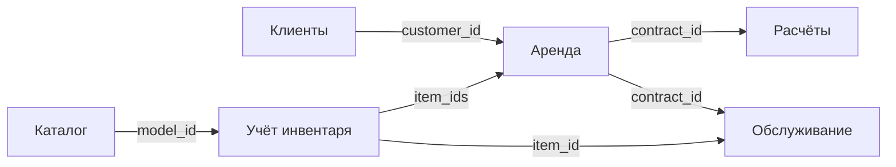

# Границы DDD и правила реализации

## Владельцы данных

| Контекст | Корни агрегатов | Локальные правила |
|---|---|---|
| Каталог | Category, EquipmentModel | Категория модели существует; родитель категории существует; название не пустое; снятие модели с публикации сохраняет историю |
| Учёт инвентаря | RentalPoint, InventoryItem, Transfer | Уникальный инвентарный номер; допустимые переходы состояния; перемещение только доступных экземпляров из указанного пункта; завершение всего перемещения одной транзакцией |
| Аренда | Tariff, Booking, RentalContract | Положительная ставка; корректный период; отсутствие пересечений для одного экземпляра; один договор на бронирование; фиксация стоимости; однократное закрытие |
| Работа с клиентами | Customer | Непустые ФИО и телефон; обязательное основание блокировки |
| Расчёты | Payment, Deposit | Положительные суммы; идемпотентность создания платежа по reference; возврат не больше оплаты; возврат и удержание залога не больше принятой суммы |
| Обслуживание | ServiceOrder, DamageReport | Один открытый заказ на экземпляр; обязательный результат закрытия; непустое описание повреждения; неотрицательная оценка ущерба |

Объекты-значения `Money` и `Period` неизменяемы и проверяют значения при создании.
В снимках агрегатов они представлены примитивами, чтобы пример хранения оставался простым.
Экземпляры в бронировании/перемещении представлены списками внешних идентификаторов.
Категории создаются с существующим родителем; изменение родителя не предоставлено,
поэтому циклы в иерархии нельзя создать через API.

## Транзакции и конкурентные запросы

1. REST-обработчик преобразует входной DTO в аргументы сценария.
2. Сценарий открывает UnitOfWork и получает агрегаты из Repository.
3. Корень агрегата проверяет свои правила и выполняет изменение.
4. Сценарий сохраняет агрегаты. При успешном выходе транзакция фиксируется.
5. Любое исключение вызывает откат всех изменений команды.

Проверка пересечения бронирований и сохранение нового бронирования идут под одной
SQLite-транзакцией `BEGIN IMMEDIATE`. Два процесса, использующие один файл базы rental,
не могут одновременно пройти проверку на свободный экземпляр. Перенос базы на
другую технологию требует сохранить эту гарантию; простого запроса SELECT недостаточно.

Чтение списков также использует этот UnitOfWork и поэтому берёт блокировку записи.
Это сознательное упрощение учебной версии; отдельные read-only транзакции и постраничные
запросы можно добавить при росте нагрузки.

## Межконтекстные связи

Стрелки показывают смысловые ссылки, не реализованную доставку событий.
Сервисы не разделяют базу данных, таблицы или доменные Python-классы.
Контекст аренды владеет календарём резервов, а inventory — физическим состоянием
и местонахождением инвентаря. `available` в inventory означает локальное состояние,
а не гарантию свободных дат в rental. Поле `point_id` при аренде или перемещении
сохраняет исходный пункт учёта; фактическое состояние определяется также `status`.

В следующем этапе для автоматической координации нужны порты приложения и внешние
HTTP-адаптеры либо интеграционные события, например `InventoryIssued`, `InventoryReturned`,
`MaintenanceCompleted`, `PaymentConfirmed`. Для надёжности доставки потребуются
outbox/inbox, повторные попытки и идемпотентные обработчики. Их в текущем этапе нет.

Валидация существования внешних объектов и распределённые бизнес-правила
(например, запрет оформления аренды заблокированному клиенту) пока остаются задачей
этой будущей координации. Локальные транзакции не считаются распределёнными.
